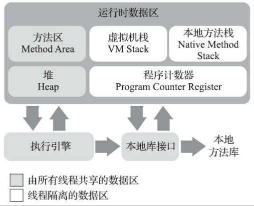
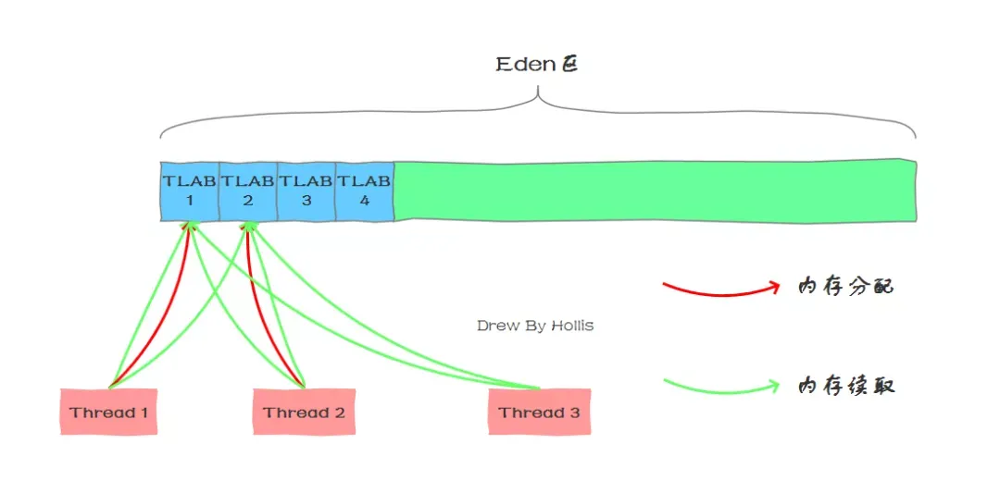
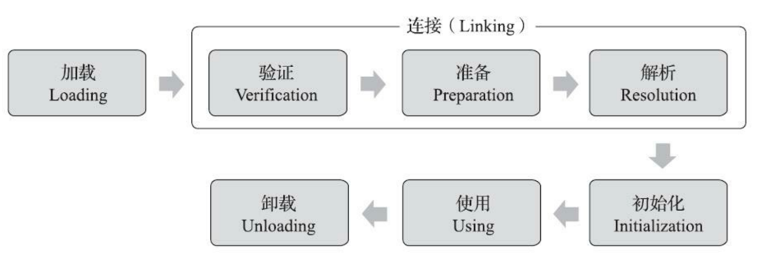
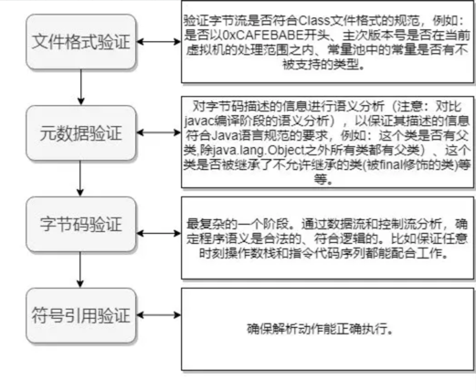
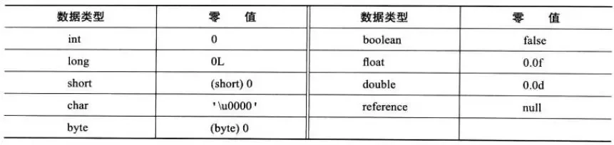
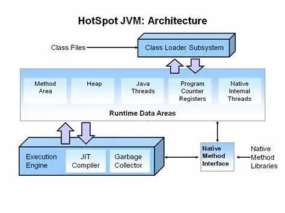

## 程序计数器
程序计数器（ProgramCounterRegister）是一块较小的内存空间。**线程私有**。如果线程正在执行的是一个Java 方法，这个计数器记录的是正在执行的虚拟机字节码指令的地址；如果正在执行的是Natvie 方法，这个计数器值则为空（Undefined）。此
内存区域是唯一一个在Java 虚拟机规范中没有规定任何OutOfMemoryError 情况的区域。

**为什么程序计数器不会OOM?**

程序计数器仅仅只是一个运行指示器,它所需要存储的内容仅仅就是下一个需要待执行的命令的地址,无论代码有多少,最坏情况下死循环也不会让这块内存区域超限,因为程序计算器所维护的就是下一条待执行的命令的地址,所以不存在OOM

## 虚拟机栈
Java虚拟机栈（JavaVirtualMachineStack）描述的是Java方法执行的线程内存模型。**线程私有**。随着线程的创建而创建，栈中存储的是帧。每个方法被执行的时候都会同时创建一个栈帧用于存储局部变量表、操作栈、动态
链接、方法出口等信息。每一个方法被调用直至执行完成的过程，就对应着一个栈帧在虚拟机栈中从入栈到出栈的过程。
帧可能是在堆上分配的，所以jvm栈使用的内存不必是连续的。

## 本地方法栈
本地方法栈（NativeMethodStacks）与虚拟机栈所发挥的作用是非常相似的，其区别只是虚拟机栈为虚拟机执行Java方法（也就是字节码）服务，而本地方法栈则是为虚拟机使用到的本地（Native）方法服务。
有的Java虚拟机（譬如Hot-Spot虚拟机）直接就把本地方法栈和虚拟机栈合二为一。与虚拟机栈一样，本地方法栈也会在栈深度溢出或者栈扩展失败时分别抛出StackOverflowError和OutOfMemoryError异常。

## 堆
Java堆（JavaHeap）是虚拟机所管理的内存中最大的一块。Java堆是被所有**线程共享**的一块内存区域，在虚拟机启动时创建。此内存区域的唯一目的就是存放对象实例。也是GC区。

从回收内存的角度看，由于现代垃圾收集器大部分都是基于分代收集理论设计的，所以大概分为新生代，老年代，永久代（分代收集算法）。
新生代从Eden区创建，复制到Survivor区（2个 from 和 to）。 GC分为minor GC 和 Full GC。

**minor GC：** 

Eden满了就触发minor GC，minorGC会将Eden区仍然存活的会复制到ToSurvivor，FromSurvivor一部分复制到老年代，一部分复制到ToSurvivor，此时原Eden和From的数据清空,from和to互换，这样的过程直到To被填满，复制到老年代。

**FullGC：**
* 年老代内存不足; 
* 持久代内存不足; 
* 统计得到的Minor GC晋升到旧生代的平均大小大于旧生代的剩余空间 
* 调用System.gc()方法的时候

从分配内存的角度看，所有线程共享的Java堆中可以划分出多个线程私有的分配缓冲区
（ThreadLocalAllocationBuffer，TLAB），以提升对象分配时的效率。不过无论从什么角度，无论如何划分，都不会改变Java堆中存储内容的共性，无论是哪个区域，存储的都只能是对象的实例，将Java 堆细分的目的只是为了更好地回收内存，或者更快地分配内存。

## 方法区
方法区（MethodArea）与Java堆一样，是各个线程共享的内存区域，它用于存储已被虚拟机加载的类型信息、常量、静态变量、即时编译器编译后的代码缓存等数据。虽然《Java虚拟机规范》中把方法区描述为堆的一个逻辑部分，但是它却有一个别名叫作“非堆”（Non-Heap），目的是与Java堆区分开来。 永久代在jdk8后被移除了，存在本地内存中的元空间代替。

运行时常量池：是方法区的一部分，Class常量池存放编译期生成的各种字面量和符号引用，运行时常量池相对于Class 文件常量池的另外一个重要特征是具备动态性，运行期间也可能将新的常量放入池中，这种特性被开发人员利用得比较多的便是String 类的intern() 方法
（这个方法会首先检查字符串池中是否有”ab”这个字符串，如果存在则返回这个字符串的引用，否则就将这个字符串添加到字符串常量池中，然会返回这个字符串的引用，这可以实现字符串的"=="比较。new String 不进入常量池，直接赋值会进入常量池）

## 对象的创建（HotSpot虚拟机）
创建对象通常（例外：复制、反序列化）仅仅是一个new关键字而已，而在虚拟机中，对象（文中讨论的对象限于普通Java对象，不包括数组和Class对象等）的创建又是怎样一个过程呢？
当Java虚拟机遇到一条字节码new指令时，首先将去检查这个指令的参数是否能在常量池中定位到一个类的符号引用，并且检查这个符号引用代表的类是否已被加载、解析和初始化过。如果没有，那必须先执行相应的类加载过程
在类加载检查通过后，接下来虚拟机将为新生对象分配内存。对象所需内存的大小在类加载完成后便可完全确定（如何确定将在2.3.2节中介绍），为对象分配空间的任务实际上便等同于把一块确定大小的内存块从Java堆中划分出来
### 分配内存方式
#### 指针碰撞
假设Java堆中内存是绝对规整的，所有被使用过的内存都被放在一边，空闲的内存被放在另一边，中间放着一个指针作为分界点的指示器，那所分配内存就仅仅是把那个指针向空闲空间方向挪动一段与对象大小相等的距离，这种分配方式称为“指针碰撞”（Bump The Pointer）
#### 空闲列表
如果Java堆中的内存并不是规整的，已被使用的内存和空闲的内存相互交错在一起，那就没有办法简单地进行指针碰撞了，虚拟机就必须维护一个列表，记录上哪些内存块是可用的，在分配的时候从列表中找到一块足够大的空间划分给对象实例，并更新列表上的记录，这种分配方式称为“空闲列表”（Free List）


选择哪种分配方式由Java堆是否规整决定，而Java堆是否规整又由所采用的垃圾收集器是否带有空间压缩整理（Compact）的能力决定。因此，当使用Serial、ParNew等带压缩整理过程的收集器时，系统采用的分配算法是指针碰撞，既简单又高效；而当使用CMS这种基于清除（Sweep）算法的收集器时，理论上就只能采用较为复杂的空闲列表来分配内存。

#### Java对象的内存分配过程是如何保证线程安全的？
##### CAS + 失败重试
对分配内存空间的动作进行同步处理——实际上虚拟机是采用CAS配上失败 重试的方式保证更新操作的原子性
##### TLAB
每个线程在Java堆中预先分配一小块内存，然后再给对象分配内存的时候，直接在自己这块”私有”内存中分配，当这部分区域用完之后，再分配新的”私有”内存。
这种方案被称之为TLAB分配，即Thread Local Allocation Buffer，本地线程分配缓冲。这部分Buffer是从堆中划分出来的，但是是本地线程独享的。
**相比同步方式，TLAB方式提升了对象的分配效率**
##### java堆内存全部是线程共享的吗？

因为有了TLAB技术，堆内存并不是完完全全的线程共享，其eden区域中还是有一部分空间是分配给线程独享的。
这里值得注意的是，我们说TLAB是线程独享的，但是只是在“分配”这个动作上是线程独享的，至于在读取、垃圾回收等动作上都是线程共享的。而且在使用上也没有什么区别。

也就是说，虽然每个线程在初始化时都会去堆内存中申请一块TLAB，并不是说这个TLAB区域的内存其他线程就完全无法访问了，其他线程的读取还是可以的，只不过无法在这个区域中分配内存而已。
并且，在TLAB分配之后，并不影响对象的移动和回收，也就是说，虽然对象刚开始可能通过TLAB分配内存，存放在Eden区，但是还是会被垃圾回收或者被移到Survivor Space、Old Gen等。
##### 大对象如何分配？
TLAB是在eden区分配的，因为eden区域本身就不太大，而且**TLAB空间的内存也非常小，默认情况下仅占有整个Eden空间的1%**。所以，必然存在一些大对象是无法在TLAB直接分配。
遇到TLAB中无法分配的大对象，对象还是可能在eden区或者老年代等进行分配的，但是这种分配就需要进行同步控制，这也是为什么我们经常说：小的对象比大的对象分配起来更加高效。
##### TLAB带来的问题
**TLAB内存区域并不是很大，所以，有可能会经常出现不够的情况。**

比如一个线程的TLAB空间有100KB，其中已经使用了80KB，当需要再分配一个30KB的对象时，就无法直接在TLAB中分配，遇到这种情况时，有两种处理方案：

1、如果一个对象需要的空间大小超过TLAB中剩余的空间大小，则直接在堆内存中对该对象进行内存分配。

2、如果一个对象需要的空间大小超过TLAB中剩余的空间大小，则废弃当前TLAB，重新申请TLAB空间再次进行内存分配。

以上两个方案各有利弊，如果采用方案1，那么就可能存在着一种极端情况，就是TLAB只剩下1KB，就会导致后续需要分配的大多数对象都需要在堆内存直接分配。
如果采用方案2，也有可能存在频繁废弃TLAB，频繁申请TLAB的情况，而我们知道，虽然在TLAB上分配内存是线程独享的，但是TLAB内存自己从堆中划分出来的过程确实可能存在冲突的，所以，TLAB的分配过程其实也是需要并发控制的。而频繁的TLAB分配就失去了使用TLAB的意义。 
##### 解决方案 定义refill_waste的值
为了解决这两个方案存在的问题，虚拟机定义了一个refill_waste的值，这个值可以翻译为“最大浪费空间”。
当请求分配的内存大于refill_waste的时候，会选择在堆内存中分配。若小于refill_waste值，则会废弃当前TLAB，重新创建TLAB进行对象内存分配。
前面的例子中，TLAB总空间100KB，使用了80KB，剩余20KB，如果设置的refill_waste的值为25KB，那么如果新对象的内存大于25KB，则直接堆内存分配，如果小于25KB，则会废弃掉之前的那个TLAB，重新分配一个TLAB空间，给新对象分配内存。

### 对象的内存布局
在HotSpot虚拟机里，对象在堆内存中的存储布局可以划分为三个部分：对象头（Header）、实例数据（Instance Data）和对齐填充（Padding）。
在 JVM 中，对象在内存中分为三块区域：
● 对象头

    ○ Mark Word（标记字段）：默认存储对象的HashCode，分代年龄和锁标志位信息。它会根据对象的状态复用自己的存储空间，也就是说在运行期间Mark Word里存储的数据会随着锁标志位的变化而变化。
    ○ Klass Point（类型指针）：对象指向它的类元数据的指针，虚拟机通过这个指针来确定这个对象是哪个类的实例。
● 实例数据

    ○ 这部分主要是存放类的数据信息，父类的信息。
● 对其填充

    ○ 由于虚拟机要求对象起始地址必须是8字节的整数倍，填充数据不是必须存在的，仅仅是为了字节对齐。Tip：不知道大家有没有被问过一个空对象占多少个字节？就是8个字节，是因为对齐填充的关系哈，不到8个字节对其填充会帮我们自动补齐。

## 类加载过程

### 加载
类加载过程的第一步，主要完成下面3件事情：
1. 通过全类名获取定义此类的二进制字节流
2. 将字节流所代表的静态存储结构转换为方法区的运行时数据结构
3. 在内存中生成一个代表该类的 Class 对象,作为方法区这些数据的访问入口

虚拟机规范多上面这3点并不具体，因此是非常灵活的。比如："通过全类名获取定义此类的二进制字节流" 并没有指明具体从哪里获取、怎样获取。比如：比较常见的就是从 ZIP 包中读取（日后出现的JAR、EAR、WAR格式的基础）、其他文件生成（典型应用就是JSP）等等。
一个非数组类的加载阶段（加载阶段获取类的二进制字节流的动作）是可控性最强的阶段，这一步我们可以去完成还可以自定义类加载器去控制字节流的获取方式（重写一个类加载器的 loadClass() 方法）。数组类型不通过类加载器创建，它由 Java 虚拟机直接创建。
类加载器、双亲委派模型也是非常重要的知识点，这部分内容会在后面的文章中单独介绍到。
加载阶段和连接阶段的部分内容是交叉进行的，加载阶段尚未结束，连接阶段可能就已经开始了。
### 验证

主要是为了保证加载进来的字节流符合虚拟机规范，不会造成安全错误。

包括对于文件格式的验证，比如常量中是否有不被支持的常量？文件中是否有不规范的或者附加的其他信息？

对于元数据的验证，比如该类是否继承了被final修饰的类？类中的字段，方法是否与父类冲突？是否出现了不合理的重载？

对于字节码的验证，保证程序语义的合理性，比如要保证类型转换的合理性。

对于符号引用的验证，比如校验符号引用中通过全限定名是否能够找到对应的类？校验符号引用中的访问性（private，public等）是否可被当前类访问？
### 准备
准备阶段是正式为类变量分配内存并设置类变量初始值的阶段，这些内存都将在方法区中分配。对于该阶段有以下几点需要注意：
1. 这时候进行内存分配的仅包括类变量（static），而不包括实例变量，实例变量会在对象实例化时随着对象一块分配在 Java 堆中。
2. 这里所设置的初始值"通常情况"下是数据类型默认的零值（如0、0L、null、false等），比如我们定义了public static int value=111 ，那么 value 变量在准备阶段的初始值就是 0 而不是111（初始化阶段才会复制）。特殊情况：比如给 value 变量加上了 fianl 关键字public static final int value=111 ，那么准备阶段 value 的值就被复制为 111。
3. 
   **基本数据类型的零值**：
    
   
为类变量（注意，不是实例变量）分配内存，并且赋予初值。
特别需要注意，**初值，不是代码中具体写的初始化的值**，而是Java虚拟机根据不同变量类型的默认初始值。
比如8种基本类型的初值，默认为0；引用类型的初值则为null；常量的初值即为代码中设置的值，final static tmp = 456， 那么该阶段tmp的初值就是456
### 解析
解析阶段是虚拟机将常量池内的符号引用替换为直接引用的过程。解析动作主要针对类或接口、字段、类方法、接口方法、方法类型、方法句柄和调用限定符7类符号引用进行。

符号引用就是一组符号来描述目标，可以是任何字面量。直接引用就是直接指向目标的指针、相对偏移量或一个间接定位到目标的句柄。在程序实际运行时，只有符号引用是不够的，举个例子：在程序执行方法时，系统需要明确知道这个方法所在的位置。Java 虚拟机为每个类都准备了一张方法表来存放类中所有的方法。当需要调用一个类的方法的时候，只要知道这个方法在方发表中的偏移量就可以直接调用该方法了。通过解析操作符号引用就可以直接转变为目标方法在类中方法表的位置，从而使得方法可以被调用。
综上，解析阶段是虚拟机将常量池内的符号引用替换为直接引用的过程，也就是得到类或者字段、方法在内存中的指针或者偏移量。
将常量池内的符号引用替换为直接引用的过程。

两个重点：

   ● 符号引用。即一个字符串，但是这个字符串给出了一些能够唯一性识别一个方法，一个变量，一个类的相关信息。

   ● 直接引用。可以理解为一个内存地址，或者一个偏移量。比如类方法，类变量的直接引用是指向方法区的指针；而实例方法，实例变量的直接引用则是从实例的头指针开始算起到这个实例变量位置的偏移量

举个例子来说，现在调用方法hello()，这个方法的地址是1234567，那么hello就是符号引用，1234567就是直接引用。

在解析阶段，虚拟机会把所有的类名，方法名，字段名这些符号引用替换为具体的内存地址或偏移量，也就是直接引用。

### 初始化
初始化是类加载的最后一步，也是真正执行类中定义的 Java 程序代码(字节码)，初始化阶段是执行类构造器 <clinit> ()方法的过程。
对于<clinit>（） 方法的调用，虚拟机会自己确保其在多线程环境中的安全性。因为 <clinit>（） 方法是带锁线程安全，所以在多线程环境下进行类初始化的话可能会引起死锁，并且这种死锁很难被发现。
对于初始化阶段，虚拟机严格规范了有且只有5中情况下，必须对类进行初始化：
1. 当遇到 new 、 getstatic、putstatic或invokestatic 这4条直接码指令时，比如 new 一个类，读取一个静态字段(未被 final 修饰)、或调用一个类的静态方法时。
2. 使用 java.lang.reflect 包的方法对类进行反射调用时 ，如果类没初始化，需要触发其初始化。
3. 初始化一个类，如果其父类还未初始化，则先触发该父类的初始化。
4. 当虚拟机启动时，用户需要定义一个要执行的主类 (包含 main 方法的那个类)，虚拟机会先初始化这个类。
5. 当使用 JDK1.7 的动态动态语言时，如果一个 MethodHandle 实例的最后解析结构为 REF_getStatic、REF_putStatic、REF_invokeStatic、的方法句柄，并且这个句柄没有初始化，则需要先触发器初始化。
   
这个阶段主要是对类变量初始化，是执行类构造器的过程。

换句话说，只对static修饰的变量或语句进行初始化。

如果初始化一个类的时候，其父类尚未初始化，则优先初始化其父类。

如果同时包含多个静态变量和静态代码块，则按照自上而下的顺序依次执行。

## 双亲委派机制
大家在开发过程中经常碰到一些类加载的问题，比如：
* ClassNotFoundException
Cause: java.lang.ClassNotFoundException: Cannot find class: com.cc.A
* NoClassDefFoundError
Cause: java.lang.NoClassDefFoundError: Cannot find class: com.cc.A

* 上述问题均和java类加载有关，如果不清楚JVM中类加载的原理，上述问题会让人郁闷至极，侥幸在网上找到解决方案也只是暂时解决问题，后续在另外的场景中碰到又会继续懵逼。
我这篇文章将对 Java 类加载器的双亲委派加载原理进行阐述，并结合实例程序深究类的双亲委派加载机制，大家彻底了解掌握类加载原理，清楚了类加载原理后，碰到上述类似问题就能快速解决，并在后续开发中避免类似问题。

### 什么是Java类加载
java类加载器负责将编译好的 Java class 件加载到 Java 虚拟机（JVM）中的运行时数据区中，供执行引擎调用。

java类加载在JVM体系结构中的位置如图所示：

没有类加载机制，编写的java程序就没法在JVM中运行，因此掌握java类加载是非常重要的。
### JVM类加载层级关系
执行java程序时，会启动一个JVM进程，JVM在启动时会做一些初始化操作，比如获取系统参数等等，然后创建一个启动类加载器，用于加载JVM运行时必须的一些类到内存中，同时也会创建其他两个类加载器扩展类加载器和系统类加载器。

启动类加载器、扩展类加载器和系统类加载器之间的关系如下图所示：


**classLoader**
* 启动类加载器：java虚拟机启动后创建的第一个类加载器，由C++语言实现，所以我们在java代码中查看其信息时，看到的均为null。
* 扩展类加载器：*由启动类加载器加载，并将扩展类加载器中的*parent的值设置为null（表示指向启动类加载器），同时继承自URLClassLoader。
* 系统类加载器：*由启动类加载器加载，并将系统类加载期中的*parent的值设置为上述创建的扩展类加载器。，同时继承自URLClassLoader。

在代码中可以通过如下方式查看类加载中的parent指向：


代码查看类加载器的parent

注意：这里的parent不是java的继承机制，而是类加载器中的一个实例属性，用于在类加载时的委托对象，parent属性定义在其所继承的ClassLoader中，定义如下所示。

```
public abstract class ClassLoader {

....................

// The parent class loader for delegation
private final ClassLoader parent;

}
```

### JVM类加载双亲委托机制
JVM加载class类文件到虚拟机时，默认首先采用系统类加载器去加载用到的class类，采用的是双亲委托加载机制。

所谓双亲委托，顾名思义，就是当前类加载器(以系统类加载器为例)在加载一个类时，委托给其双亲（注意这里的双亲指的是类加载器中parent属性指向的类加载器）先进行加载。
双亲类加载器在加载时同样委托给自己的双亲，如此反复，直到某个类加载器没有双亲为止（通常情况下指双亲为null，也即为当前的双亲为扩展类加载器，其parent为启动类加载器），然后开始在依次在各自的类路径下寻找、加载class类。

如下图所示：


### 双亲委派机制的作用

1、防止重复加载同一个.class。通过委托去向上面问一问，加载过了，就不用再加载一遍。保证数据安全。 
2、保证核心.class不能被篡改。通过委托方式，不会去篡改核心.clas，即使篡改也不会去加载，即使加载也不会是同一个.class对象了。不同的加载器加载同一个.class也不是同一个Class对象。这样保证了Class执行安全。

### 打破双亲委派机制
自定义类加载器 ，重写loadclass方法

双亲委派模型只是jvm规范要求。
实际上自己实现的classLoader遵不遵守这个规范完全按照自己的业务需求来定。

